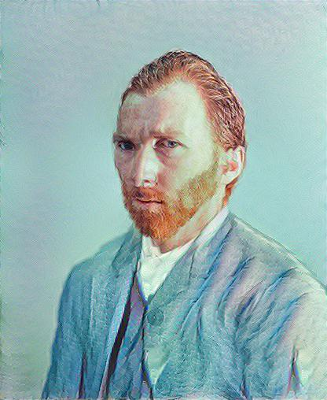
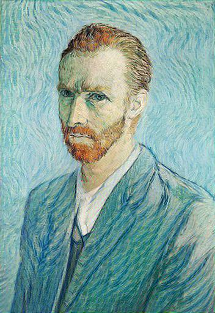

# Neural Doodle
在[alexjc](https://github.com/alexjc/neural-doodle)的基础上用tensorflow重新实现了该算法，思路和原论文基本一致，实现细节上有所差别。下面是L-BFGS迭代了200次的结果图。

## 参考资料
1. [Semantic Style Transfer and Turning Two-Bit Doodles into Fine Artworks](https://arxiv.org/abs/1603.01768)
2. [Fast Patch-based Style Transfer of Arbitrary Style](https://arxiv.org/abs/1612.04337)
3. [zero-shot-style-transfer](https://github.com/LucasSheng/zero-shot-style-transfer)